# 用户手册

> 白润声  王皓雯

## 用户

### 注册账号

启动程序后，进入下面的登录页面。

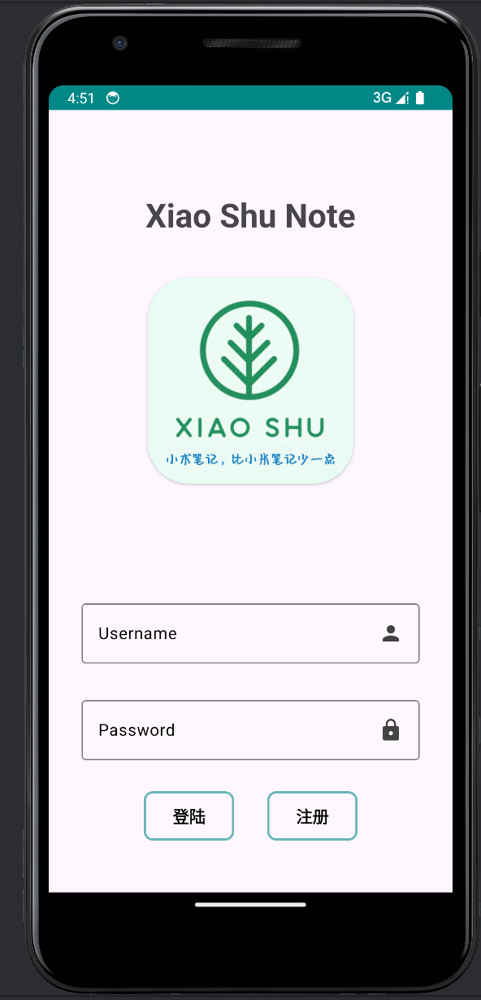

点击右下角的注册按钮，进入注册页面。

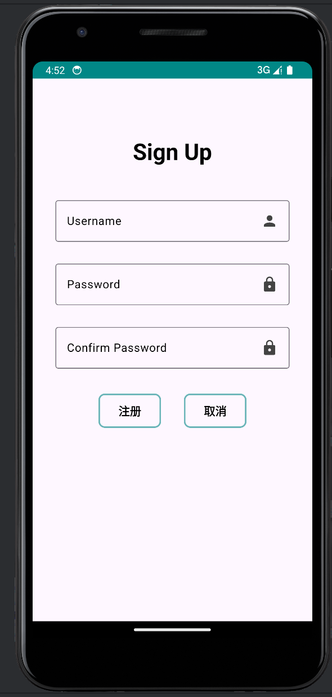

输入用户名和密码。注意用户名不能与已有的用户名重复，且两次密码输入必须一样。注册成功后会自动跳转到登录页面。注册成功和失败皆有提示语。

### 登录账号

启动程序，或者注册成功，或者取消注册后会跳转到登录页面。

输入用户名和密码即可登录。登录成功和失败皆有提示语。

### 个人主页

左滑“笔记”页面，或者点击“我的”页面，即可显示个人主页。

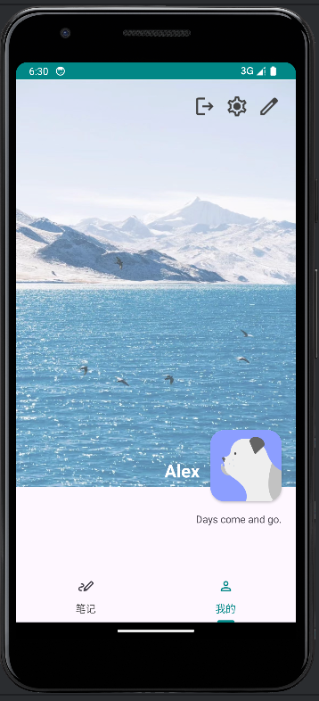

页面显示了头像、用户名和个性签名。

### 修改密码

点击个人主页的右上角的“齿轮”（中间的图标），即可进入修改密码页面。

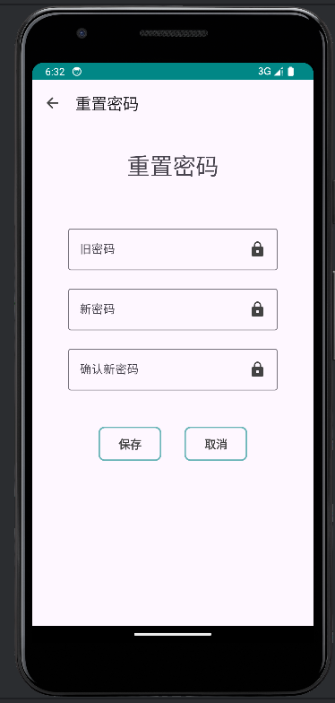

输入旧密码与新密码，点击保存即可修改密码。注意，旧密码必须输入正确，并且两次输入的新密码必须一样才能成功修改密码。

### 个人信息修改

个人页面点击“编辑”（最右边的图标），即可进入个人信息修改页面。

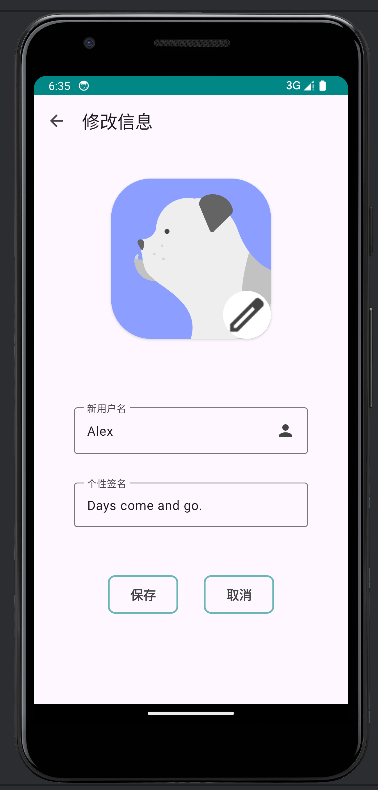

修改头像时可以点击“编辑”按钮（头像右下角），从本地相册中选择照片。用户名和个性签名默认为当前信息，可以进行修改。点击保存即可提交信息。注意，新设置的用户名不能和当前其他用户的用户名重复。

修改后自动跳转到个人主页，信息已经更新。

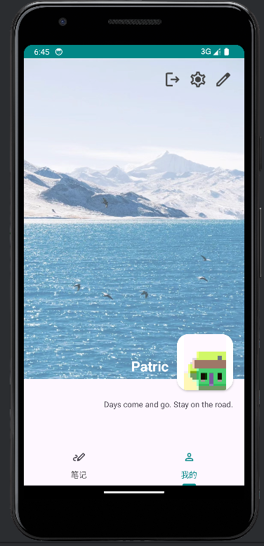

### 登出账号

点击个人主页的“登出”（最左边的图标），即可登出账号。程序自动跳转到登录页面。

## 笔记

### 查看

#### 浏览笔记

进入笔记页面后，可以浏览当前已有笔记和文件夹：点击笔记文件，会直接跳转到相应笔记的编辑页面；点击文件夹，则页面会获取到该文件夹内的所有文件并显示，如下图中左图点击folder文件夹，会跳转到右图所示界面；点击左上角返回按钮，会返回上一级路径，如下图中右图点击返回按钮会跳转到左图，另外若当前已为根路径，点击返回只会刷新页面。

 
    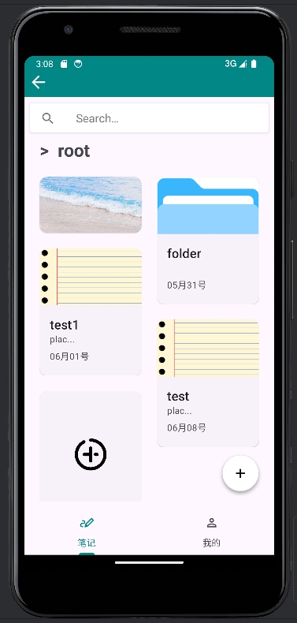
    
    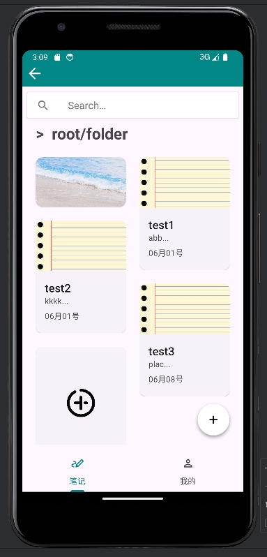

#### 搜索内容

在搜索框内输入关键词（多个关键词可以用空格隔开）并点击回车或搜索按钮，就会跳转到搜索结果，如下图展示了对关键词”ab 12“的搜索结果。点击搜索结果中的笔记即可跳转到编辑页面，点击左上角的退出按钮即可返回浏览页面。

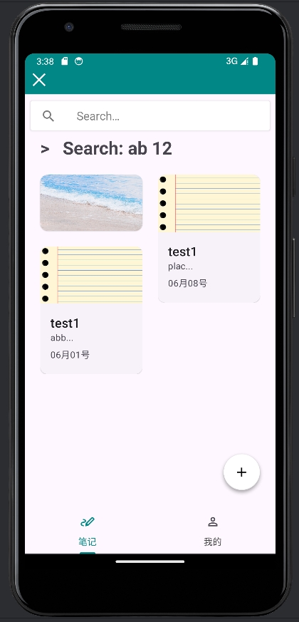

### 编辑

#### 添加和删除笔记

在主页面，点击右下角的加号会展开选择列表，按钮分别代表添加笔记或文件夹，如下图左侧所展示。点击其中之一会弹出如下图中间所示的弹窗，编辑标题点击创建后即可创建新文件。另外，创建笔记弹窗也可由笔记队列末尾的加号按钮唤醒。如果想删除一个文件，可长按指定文件，一段时间后会弹出删除选项，点击即可删除，如下图右侧test1的删除选项。需要注意删除文件夹时，其包含文件也均会被删除。

 
    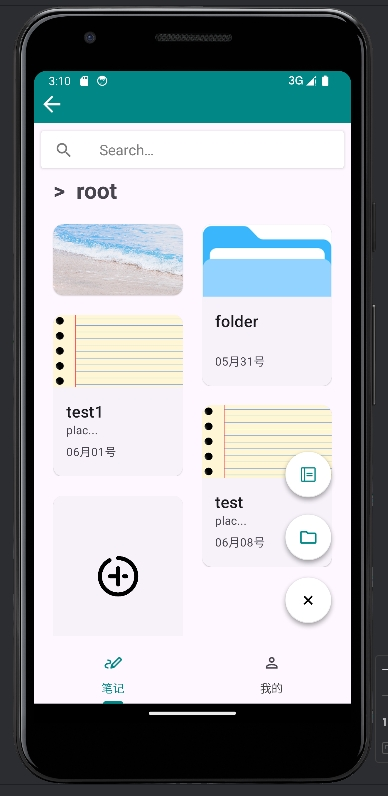
    
    
    
    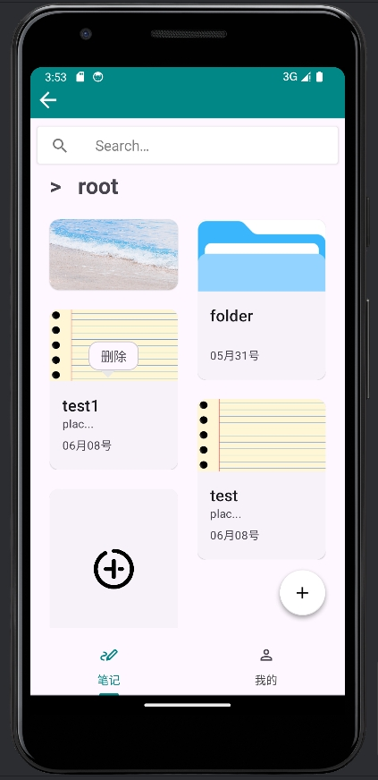

#### 编辑标题与文本内容

可以直接编辑笔记的标题和文本内容，笔记会实时更新到云端。如下图所示，标题改后退回到主页面时，笔记标题会同步更新。重新查看笔记详情时，内容为更新后的。

 
    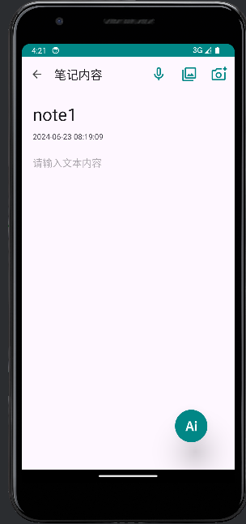
    
    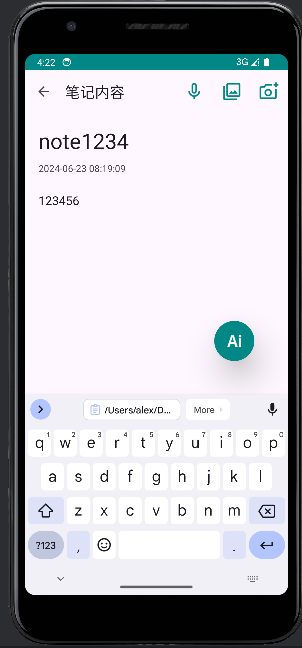
    
    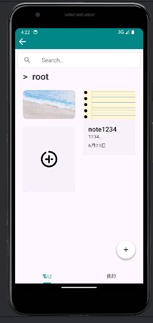

#### 添加图片

##### 相机拍摄

进入笔记详情页面，点击右上角的相机图标即可进行拍摄（最右边的图标）。拍摄后如果选择确认，则照片会插入到笔记中。

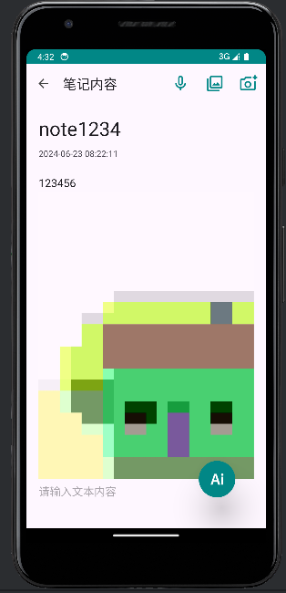

##### 本地图片选择

进入笔记详情页面，点击右上角的相册图标即可从本地相册中选择图片插入到笔记中（中间的图标）。

 
    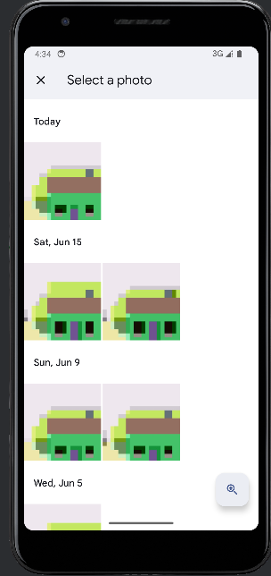
    
    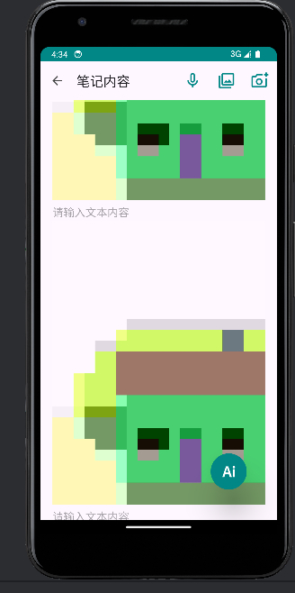

#### 添加音频

进入笔记详情页面，点击右上角的麦克风图标即可开始录音，再次点击同一位置的终止图标即可停止录音。录音得到的音频文件会插入到笔记中。点击音频上的开始播放按钮可以播放该录音，再点击暂停播放按钮可以暂停播放。

 
    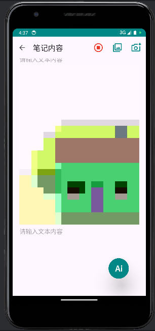
    
    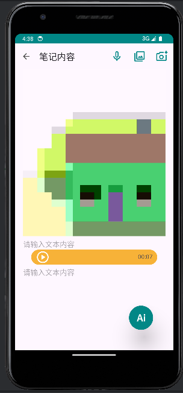
  	
    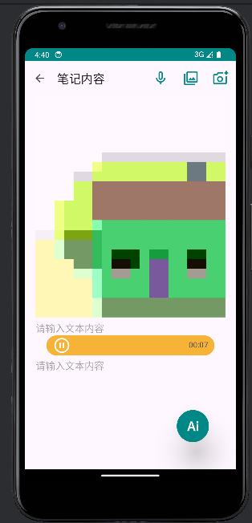

#### 删除图片与音频

长按图片或者音频文件，一段时间后会弹出删除选项，点击即可删除。删除后笔记内容会同步到云端，并且前端实时更新。

 
    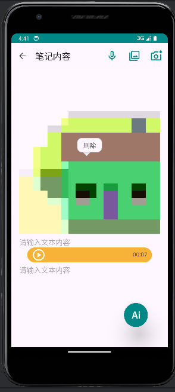
    
    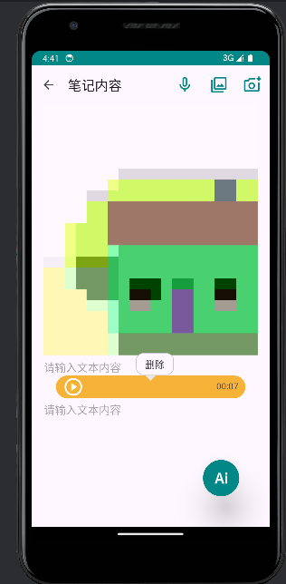

## 笔记智能辅助

### AI对话

在笔记页面中，点击右上角选项栏中的AI对话，可以唤醒AI对话弹窗进行交互。用户可以在问题框中编辑问题，并点击发送按钮发送，如下图左侧所示。AI默认知道笔记中的内容信息。等待回答期间，弹窗会切换响应提示语，并在一段时间获取到回答后，在对话框中显示答案，如下图右侧所示。用户可以复制回答到剪贴板，或者在浏览信息后直接退出，返回编辑页面。

 
    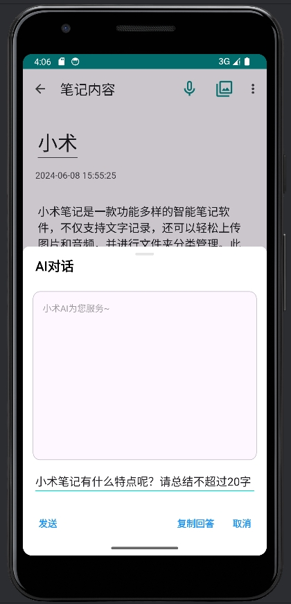
    
    

